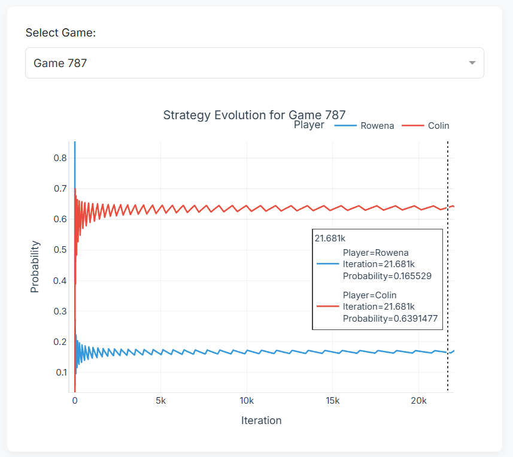

# Fictitious Play Simulation



This repository contains a complete implementation of the Fictitious Play algorithm for 2×2 zero-sum games, along with visualization tools to analyze convergence behavior.

## Overview

Fictitious Play is an iterative algorithm where players repeatedly play a game, with each player selecting the best response to their opponent's empirical mixed strategy. This repo includes:

- Generation of arbitrary 2×2 zero-sum games
- Implementation of the Fictitious Play algorithm
- Interactive visualization dashboard

## Requirements

- Python 3.8 or higher
- pandas
- numpy
- plotly
- dash
- pyarrow
- tqdm

Install dependencies:

```
pip install pandas numpy plotly dash pyarrow tqdm
```

## Usage

### Run the Interactive Dashboard

To launch the interactive dashboard with the included dataset:

```
python main.py
```

### Run New Experiments

To generate new data by running multiple Fictitious Play experiments:

```
python src/run_experiments.py
```

Parameters can be adjusted in the script:
- `number_of_experiments`: Number of random games to generate
- `epsilon`: Convergence threshold
- `window_size`: Size of the sliding window that stores recent actions
- `max_iterations`: Maximum number of iterations per game

## Algorithm Details

The Fictitious Play implementation:

1. **Generating Games**: Creates random 2×2 zero-sum games by uniformly sampling utilities
2. **Fictitious Play**: Tracks empirical mixed strategies and computes best responses at each iteration
3. **Convergence**: Declares convergence when the difference between maximum and minimum values in a sliding window falls below the threshold ε